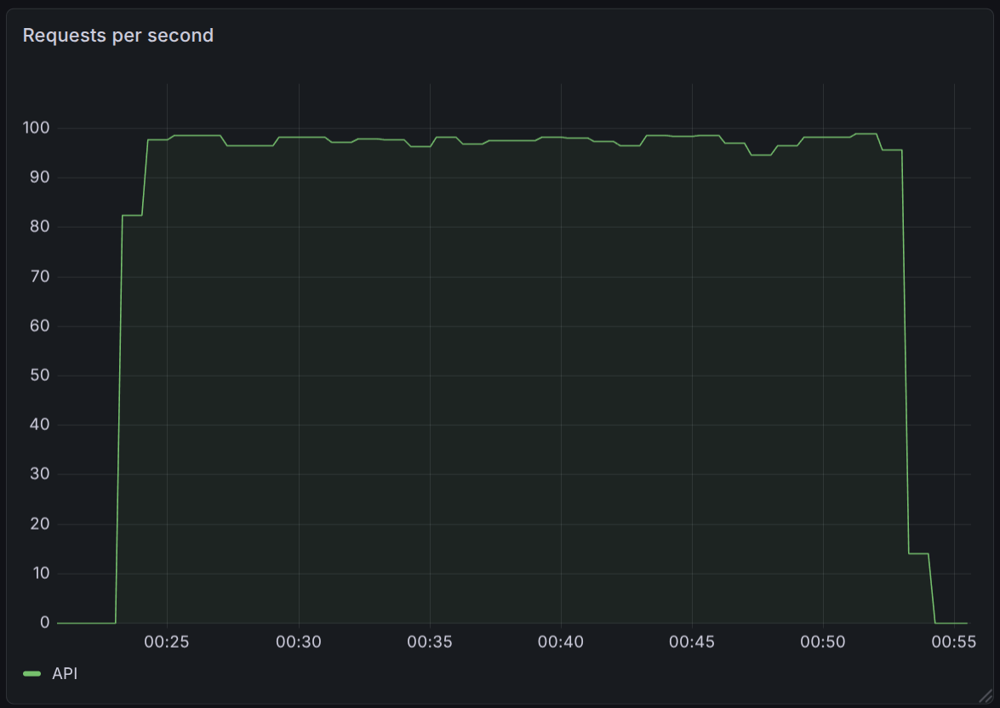
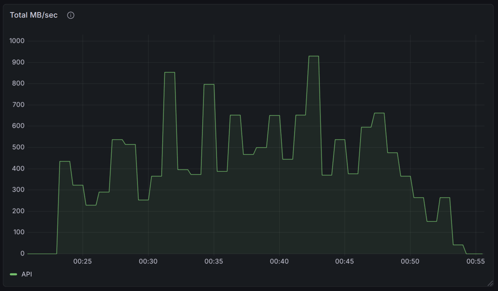
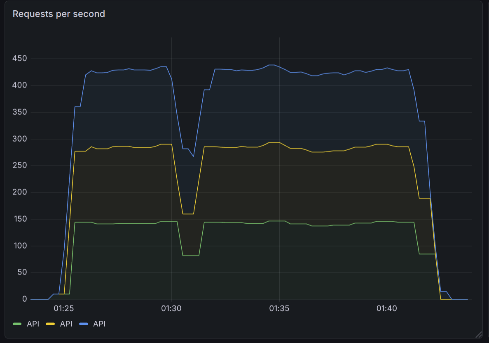
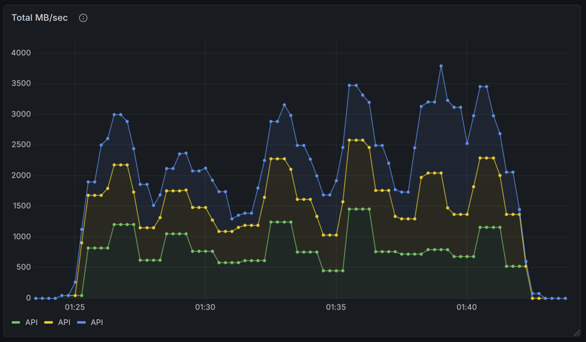

# Cloudbreak Benchmarks & Load Testing

Performance and load-testing results for Cloudbreak, produced with the
[`integration_tests`](../../crates/integration_tests/README.md) crate. All traffic is **replayed
from real production traffic** captured in VictoriaLogs archives, so the request mix (payload sizes,
encodings) reflects actual usage rather than a synthetic distribution. Results currently cover
`getProgramAccounts` (gPA).

> **How to read the tables:** latency is reported per `(size, encoding)` category. See the
> [Output Summary](../../crates/integration_tests/README.md#output-summary) section of the
> integration_tests README for the meaning of every column, the size buckets, and the slot-comparison
> semantics.

---

## Highlights

- **Correctness vs Agave:** Cloudbreak matched **1,773 / 1,773** responses (0 mismatches) while being
  **72–100% faster at P50** across nearly every payload category (Case 1).
- **Single-node throughput (EPYC Gen3):** sustained **~97 RPS** for 30 minutes, with P50 of 4-5 ms on
  the dominant small-payload traffic (Case 2).
- **Scale-out (EPYC Gen4, 3 API tasks → 1 DB):** **~428 RPS aggregate** with near-identical per-task
  latency — clean horizontal scaling of the API tier against a shared Postgres (Case 3).

---

## Methodology

|                        |                                                                                                                                                 |
| ---------------------- | ----------------------------------------------------------------------------------------------------------------------------------------------- |
| Tooling                | `integration_tests` crate (`cargo run --bin integration_tests -- benchmark <type>`)                                                             |
| RPC method             | `getProgramAccounts` (gPA)                                                                                                                      |
| Traffic source         | Real traffic replayed from **VictoriaLogs** archives                                                                                            |
| Runtime index creation | **Enabled** — Cloudbreak creates DB indexes on the fly during the run                                                                           |
| Commit (`main`)        | [`0290365`](https://github.com/solana-rpc/cloudbreak/commit/029036557b9cf5d18f0a738710372a505d344242) — _Implement getVoteAccounts method (#9)_ |
| Date                   | 2026-06-29                                                                                                                                      |

**Notes & caveats**

- Because index creation happens _during_ the run, early requests for a not-yet-indexed access
  pattern can show elevated latency that improves as indexes come online. This is intentional — it
  measures Cloudbreak under realistic cold-to-warm conditions.
- Latency numbers are end-to-end (client-observed). All measurements were taken **within the same
  datacenter** as the endpoint(s) to minimize network transport time, so the figures reflect
  server-side processing rather than wide-area network latency. This applies to all three cases.
- Percentiles (P50/P90/P99) are more meaningful than averages for tail behavior; call out tail
  latency when interpreting results.
- Categories with very few requests (small `Count` / `N`, e.g. the largest payload buckets) have
  high-variance percentiles — a single slow request can dominate P90/P99. Read low-count rows with
  caution.

---

## Cases at a glance

| #   | Case                                                                                         | Purpose                                        | Endpoint(s)             | Node               | Charts    |
| --- | -------------------------------------------------------------------------------------------- | ---------------------------------------------- | ----------------------- | ------------------ | --------- |
| 1   | [Low-RPS comparison vs Agave](#case-1--low-rps-comparison-vs-agave)                          | Correctness + latency vs a reference Agave RPC | Cloudbreak **vs** Agave | —                  | —         |
| 2   | [Cloudbreak load — EPYC Gen3](#case-2--cloudbreak-load--epyc-gen3)                           | Sustained load on a single node                | Cloudbreak only         | EPYC Gen3          | RPS, MB/s |
| 3   | [Cloudbreak load — EPYC Gen4 (3 API tasks)](#case-3--cloudbreak-load--epyc-gen4-3-api-tasks) | Scale-out: 3 API tasks → 1 DB                  | Cloudbreak only         | EPYC Gen4          | RPS, MB/s |

---

## Case 1 — Low-RPS comparison vs Agave

**Goal:** validate correctness and compare latency of Cloudbreak against a reference **Agave** RPC
endpoint under a low, steady request rate. Because two endpoints are configured, the run also reports
response match/mismatch counts and slot differences.

### Environment

| | |
| --- | --- |
| rpc1 | Cloudbreak |
| rpc2 (reference) | Agave |
| Load model | 2 target RPS, every request mirrored to **both** endpoints (`ratio = 1.0`) |
| Comparison | slot compensation enabled; `retry_in_place` enabled |
| Config | [`case-1-agave-comparison/config.toml`](case-1-agave-comparison/config.toml) |

### Overview

| | |
| --- | --- |
| Duration | 1801.9s (~30 min) |
| Total requests | 3,550 (both endpoints combined) |
| Effective RPS | 2.0 |
| Comparisons | **1,773 matches · 0 mismatches · 0 no-context mismatches** |

Every compared response matched (100% correctness against Agave), so no slot-difference block was
produced.

### Latency (Cloudbreak vs Agave)

Negative **P50 diff** means Cloudbreak (rpc1) is faster. `N` is the per-endpoint request count.

| Size | Encoding | N (cb) | Avg (cb) | P50 (cb) | P90 (cb) | P99 (cb) | N (agave) | Avg (agave) | P50 (agave) | P90 (agave) | P99 (agave) | P50 diff |
| --- | --- | ---: | ---: | ---: | ---: | ---: | ---: | ---: | ---: | ---: | ---: | ---: |
| 0-1KB | base64 | 547 | 5.3 | 4 | 10 | 15 | 547 | 1,133.0 | 154 | 2,558 | 5,881 | −97% |
| 1-10KB | base64 | 662 | 4.3 | 4 | 5 | 11 | 662 | 1,725.4 | 2,297 | 2,478 | 6,348 | −100% |
| 10-100KB | base64 | 244 | 6.8 | 5 | 11 | 42 | 244 | 2,724.6 | 4,194 | 4,699 | 6,386 | −100% |
| 100KB-1MB | base64 | 181 | 7.8 | 7 | 13 | 23 | 181 | 3,970.8 | 4,476 | 4,693 | 5,464 | −100% |
| 1MB-10MB | base64 | 53 | 47.1 | 12 | 25 | 694 | 53 | 3,692.9 | 4,487 | 4,708 | 5,608 | −100% |
| 10MB-50MB | base64 | 1 | 389.0 | 389 | 389 | 389 | 1 | 3,372.0 | 3,372 | 3,372 | 3,372 | −88% |
| 100MB-200MB | base64 | 1 | 2,257.0 | 2,257 | 2,257 | 2,257 | 1 | 80,912.0 | 80,912 | 80,912 | 80,912 | −97% |
| 200MB-500MB | base64 | 22 | 564.2 | 526 | 678 | 730 | 22 | 2,005.1 | 1,866 | 2,851 | 3,086 | −72% |
| 0-1KB | base64+zstd | 45 | 5.0 | 4 | 9 | 11 | 45 | 0.0 | 0 | 0 | 1 | — |
| 100KB-1MB | base64+zstd | 1 | 76.0 | 76 | 76 | 76 | 1 | 64.0 | 64 | 64 | 64 | +19% |
| 0-1KB | jsonParsed | 9 | 4.2 | 4 | 5 | 5 | 9 | 5,591.6 | 5,572 | 5,793 | 5,954 | −100% |
| 1-10KB | jsonParsed | 1 | 4.0 | 4 | 4 | 4 | 1 | 5,667.0 | 5,667 | 5,667 | 5,667 | −100% |
| 10MB-50MB | jsonParsed | 8 | 280.1 | 266 | 284 | 377 | 8 | 708.0 | 626 | 1,016 | 1,029 | −58% |

**Takeaway:** at this low, steady rate Cloudbreak returns identical responses to Agave (0 mismatches)
while being **dramatically faster** — P50 improvements of −72% to −100% across nearly every category,
often the difference between single-digit milliseconds and multiple seconds.

> The `base64+zstd` 0-1KB row shows Agave at ~0ms with no P50 diff computed; those near-zero Agave
> timings on a handful of requests are not a meaningful comparison and should be read with caution.

---

## Case 2 — Cloudbreak load — EPYC Gen3

**Goal:** measure Cloudbreak throughput and latency under sustained replayed load on a single
**EPYC Gen3** node (cost ~$400/month), single API task.

### Environment

| | |
| --- | --- |
| Node | AMD EPYC **Gen3** |
| Topology | 1 API task → 1 Postgres |
| Load model | Single load stream at **100 target RPS** |
| Config | [`case-2-epyc-gen3/config.toml`](case-2-epyc-gen3/config.toml) |

### Overview

| | |
| --- | --- |
| Duration | 1806.2s (~30 min) |
| Total requests | **175,559** |
| Effective RPS | **97.2** (100 target) |

### Latency by payload size

| Size | Encoding | Count | Avg (ms) | P50 | P90 | P99 |
| --- | --- | ---: | ---: | ---: | ---: | ---: |
| 0-1KB | base64 | 56,266 | 61.6 | 4 | 123 | 863 |
| 1-10KB | base64 | 61,872 | 60.5 | 4 | 122 | 894 |
| 10-100KB | base64 | 20,865 | 44.1 | 4 | 80 | 956 |
| 100KB-1MB | base64 | 23,608 | 30.6 | 5 | 45 | 804 |
| 1MB-10MB | base64 | 4,454 | 64.6 | 9 | 123 | 925 |
| 10MB-50MB | base64 | 158 | 410.6 | 264 | 839 | 1,762 |
| 50MB-100MB | base64 | 34 | 1,144.0 | 693 | 2,041 | 3,119 |
| 100MB-200MB | base64 | 46 | 2,057.2 | 1,937 | 2,435 | 3,227 |
| 200MB-500MB | base64 | 2,552 | 601.0 | 408 | 745 | 6,146 |
| 500MB+ | base64 | 12 | 2,230.9 | 1,277 | 6,894 | 7,354 |
| 0-1KB | base64+zstd | 3,568 | 31.8 | 4 | 15 | 826 |
| 100KB-1MB | base64+zstd | 134 | 108.3 | 70 | 83 | 1,205 |
| 0-1KB | jsonParsed | 1,035 | 39.3 | 4 | 41 | 766 |
| 1-10KB | jsonParsed | 47 | 5.7 | 4 | 9 | 55 |
| 100KB-1MB | jsonParsed | 11 | 140.4 | 142 | 144 | 144 |
| 1MB-10MB | jsonParsed | 87 | 97.7 | 72 | 286 | 425 |
| 10MB-50MB | jsonParsed | 810 | 340.7 | 313 | 381 | 1,054 |

### Interpreting the tail (P99)

The elevated P99s concentrate on the largest payloads (200MB-500MB reaches 6,146ms, 500MB+ reaches
7,354ms) and stem from two compounding factors: **runtime index creation** (requests hitting a
not-yet-built index take a slower path until it comes online) and **node resource contention** under
sustained load. The bulk of traffic — small `base64` / `base64+zstd` / `jsonParsed` — stays low, with
P50 at 4-5ms and P90 in the tens-to-low-hundreds of ms.

### Time series

Throughput held a steady ~97 RPS for the full ~30-minute run while data served fluctuated between
~200 and ~930 MB/s, tracking the payload-size mix of the replayed traffic.

**Requests per second** — from the `cloudbreak_api_requests_by_subscription_id` API metric.



**Throughput (MB/s)** — from the `cloudbreak_api_data_fetched_by_subscription_id` API metric.



<details>
<summary>Raw BENCHMARK SUMMARY (verbatim)</summary>

See [`case-2-epyc-gen3/summary.txt`](case-2-epyc-gen3/summary.txt).

</details>

---

## Case 3 — Cloudbreak load — EPYC Gen4 (3 API tasks)

**Goal:** measure scale-out behavior on a single **EPYC Gen4** node (cost ~$1000/month) running **3 API tasks that all
point at the same database**, under sustained replayed load.

### Environment

|            |                                                                                                   |
| ---------- | ------------------------------------------------------------------------------------------------- |
| Node       | AMD EPYC **Gen4**                                                                                 |
| Topology   | **3 API tasks → 1 shared Postgres**                                                               |
| Load model | Each API task driven by its own load stream at **150 target RPS** (≈450 RPS offered in aggregate) |
| Config     | [`case-3-epyc-gen4-3-api-tasks/config.toml`](case-3-epyc-gen4-3-api-tasks/config.toml)            |

### Overview

Aggregate across the three API tasks over a ~1000s run:

|                         |                                   |
| ----------------------- | --------------------------------- |
| Total requests          | **429,050**                       |
| Aggregate effective RPS | **428.6** (143.6 + 142.9 + 142.1) |
| Offered RPS             | 450 (3 × 150 target)              |
| Dropped (backpressure)  | 14 total (~0.0%)                  |

The three tasks behaved near-identically, which is the headline result: the API tier scales
horizontally on a single node against one shared Postgres with no meaningful per-task divergence.

### Latency by payload size

Task 1 is shown below as representative; tasks 2 and 3 are collapsed beneath it.

**API task 1** — Duration 1001.6s · 143,798 requests · 143.6 RPS

| Size        | Encoding    |  Count | Avg (ms) |   P50 |   P90 |   P99 |
| ----------- | ----------- | -----: | -------: | ----: | ----: | ----: |
| 0-1KB       | base64      | 68,029 |     73.0 |     7 |   175 |   803 |
| 1-10KB      | base64      | 50,896 |     92.9 |    77 |   182 |   860 |
| 10-100KB    | base64      |  9,414 |     56.1 |     5 |   144 |   879 |
| 100KB-1MB   | base64      |  3,547 |     66.2 |     8 |    73 | 1,214 |
| 1MB-10MB    | base64      |  2,753 |    187.4 |   125 |   235 | 1,301 |
| 10MB-50MB   | base64      |     99 |    769.3 |   673 | 1,412 | 2,206 |
| 50MB-100MB  | base64      |     33 |  2,005.4 | 1,918 | 2,660 | 2,716 |
| 100MB-200MB | base64      |     70 |  2,504.2 | 2,026 | 5,379 | 7,103 |
| 200MB-500MB | base64      |  2,322 |    466.5 |   443 |   558 | 1,205 |
| 0-1KB       | base64+zstd |  3,741 |     13.9 |     4 |    11 |   170 |
| 100KB-1MB   | base64+zstd |    261 |     97.4 |    72 |   118 |   805 |
| 0-1KB       | jsonParsed  |  1,622 |     25.6 |     4 |    33 |   829 |
| 1-10KB      | jsonParsed  |     56 |     29.4 |     5 |    47 |    58 |
| 10-100KB    | jsonParsed  |     33 |      6.5 |     5 |     9 |    36 |
| 100KB-1MB   | jsonParsed  |      9 |    118.0 |    27 |    61 |   820 |
| 1MB-10MB    | jsonParsed  |     30 |     21.9 |    24 |    28 |    40 |
| 10MB-50MB   | jsonParsed  |    883 |    311.1 |   289 |   345 | 1,121 |

<details>
<summary><b>API task 2</b> — Duration 1000.6s · 143,001 requests · 142.9 RPS</summary>

| Size        | Encoding    |  Count | Avg (ms) |   P50 |   P90 |   P99 |
| ----------- | ----------- | -----: | -------: | ----: | ----: | ----: |
| 0-1KB       | base64      | 65,457 |     74.5 |     7 |   176 |   853 |
| 1-10KB      | base64      | 49,037 |     91.9 |    33 |   184 |   861 |
| 10-100KB    | base64      | 12,133 |     72.4 |     5 |   188 |   914 |
| 100KB-1MB   | base64      |  5,384 |     45.1 |     9 |    85 |   823 |
| 1MB-10MB    | base64      |  2,440 |    139.0 |   118 |   199 | 1,160 |
| 10MB-50MB   | base64      |     37 |    287.0 |   279 |   502 |   551 |
| 50MB-100MB  | base64      |     23 |  2,126.0 | 1,896 | 2,823 | 2,906 |
| 100MB-200MB | base64      |    136 |  2,002.1 | 1,979 | 2,297 | 2,605 |
| 200MB-500MB | base64      |  2,599 |    487.5 |   445 |   573 | 1,306 |
| 0-1KB       | base64+zstd |  2,382 |     19.8 |     4 |    24 |   777 |
| 100KB-1MB   | base64+zstd |    371 |    115.2 |    72 |   103 |   943 |
| 1MB-10MB    | base64+zstd |     14 |    262.8 |   196 |   433 |   963 |
| 0-1KB       | jsonParsed  |  1,685 |     31.6 |     4 |    47 |   785 |
| 1-10KB      | jsonParsed  |     46 |     13.5 |     4 |    24 |   254 |
| 10-100KB    | jsonParsed  |     39 |     32.2 |     4 |    12 |   837 |
| 1MB-10MB    | jsonParsed  |     57 |    102.5 |    30 |    76 |   827 |
| 10MB-50MB   | jsonParsed  |  1,161 |    347.5 |   295 |   476 | 1,069 |

</details>

<details>
<summary><b>API task 3</b> — Duration 1000.9s · 142,251 requests · 142.1 RPS · 14 dropped (0.0%)</summary>

| Size        | Encoding    |  Count | Avg (ms) |   P50 |   P90 |   P99 |
| ----------- | ----------- | -----: | -------: | ----: | ----: | ----: |
| 0-1KB       | base64      | 67,027 |     72.3 |     6 |   176 |   895 |
| 1-10KB      | base64      | 47,503 |     90.6 |    18 |   184 |   905 |
| 10-100KB    | base64      | 11,403 |     62.6 |     5 |   151 |   942 |
| 100KB-1MB   | base64      |  5,670 |     55.5 |    12 |    87 | 1,119 |
| 1MB-10MB    | base64      |  2,453 |    156.2 |   122 |   231 | 1,269 |
| 10MB-50MB   | base64      |     37 |    294.6 |   285 |   371 |   710 |
| 50MB-100MB  | base64      |     36 |  1,996.9 | 1,933 | 2,564 | 2,842 |
| 100MB-200MB | base64      |    115 |  2,494.1 | 2,046 | 2,770 | 8,505 |
| 200MB-500MB | base64      |  2,543 |    517.4 |   474 |   610 | 1,628 |
| 0-1KB       | base64+zstd |  2,386 |     22.9 |     5 |    23 |   759 |
| 100KB-1MB   | base64+zstd |    283 |    124.0 |    73 |   146 | 1,002 |
| 0-1KB       | jsonParsed  |  1,522 |     24.1 |     4 |    30 |   556 |
| 1-10KB      | jsonParsed  |     56 |     10.6 |     5 |    30 |    50 |
| 10-100KB    | jsonParsed  |     35 |      6.1 |     4 |     9 |    28 |
| 1MB-10MB    | jsonParsed  |     53 |     32.1 |    29 |    40 |    65 |
| 10MB-50MB   | jsonParsed  |  1,129 |    339.9 |   301 |   395 | 1,204 |

</details>

### Interpreting the tail (P99)

The elevated P99s (e.g. 100MB-200MB base64 reaching 7,103ms on task 1 and 8,505ms on task 3) come
from two compounding factors:

- **Runtime index creation.** Indexes are built on the fly during the run, so requests hitting an
  access pattern whose index is not yet in place are served without it — a slower path that resolves
  once the index comes online.
- **Node resource contention.** Sustained load with three API tasks sharing the node (and one
  Postgres) drives CPU/IO pressure that degrades tail latency, most visibly on the largest payloads
  where per-request cost is highest.

Both effects concentrate in the tail and on large payloads; the bulk of traffic (small `base64` /
`base64+zstd`) stays low (single-digit to low-hundreds ms at P50/P90).

### Time series

**Requests per second** — from the `cloudbreak_api_requests_by_subscription_id` API metric.



**Throughput (MB/s)** — from the `cloudbreak_api_data_fetched_by_subscription_id` API metric.



<details>
<summary>Raw BENCHMARK SUMMARY (verbatim)</summary>

See [`case-3-epyc-gen4-3-api-tasks/summary.txt`](case-3-epyc-gen4-3-api-tasks/summary.txt).

</details>

---

## Reproducing

```sh
# Copy and edit the example config (see each case's config.toml for the exact settings used)
cp example.cloudbreak.integration_tests.toml cloudbreak.integration_tests.toml

# Run a benchmark (getProgramAccounts shown; see the crate README for other types)
cargo run --bin integration_tests -- benchmark gpa
```

See the [`integration_tests` README](../../crates/integration_tests/README.md) for the full
configuration reference (traffic source, comparison, slot compensation, logging, and output format).
